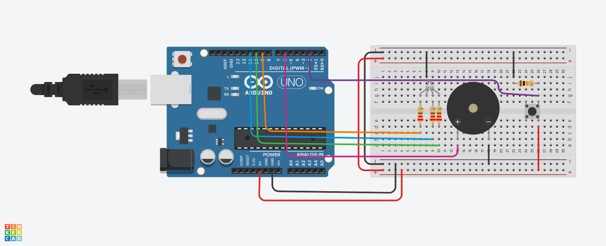

# Arduino_Proyecto_Cancion

<br>

**Alejandro Barrionuevo Rosado**

<h3>Canciones:</h3>

- **Unravel**

- **Marcha imperial de Star Wars**

<br>
<hr>
<br>




<br>
<hr>

**Materiales:**

- Microcontrolador Arduino
- Buzzer pasivo
- Pulsador
- Diodo Led RGB
- Resistencia 10Kohm
- Resistencia 220ohm
- Resistencia 220ohm
- Resistencia 220ohm

Modelo de Arduino: Arduino UNO

**Variables para los tonos:**

<!-- Variables para los tonos -->
```c
const float Do = 523.25;
const float DoS = 554.37;
const float Re = 587.33;
const float ReS = 622.25;
const float Mi = 659.26;
const float Fa = 698.46;
const float FaS = 739.99;
const float Sol = 783.99;
const float SolS = 830.61;
const float La = 880;
const float LaS = 932.33;
const float Si = 493;
const float Re2 = 1174.66;
const float FaS2 = 1479.98;

const int NEGRA = 250;
const int BLANCA = 500;

```

**Esquema**


